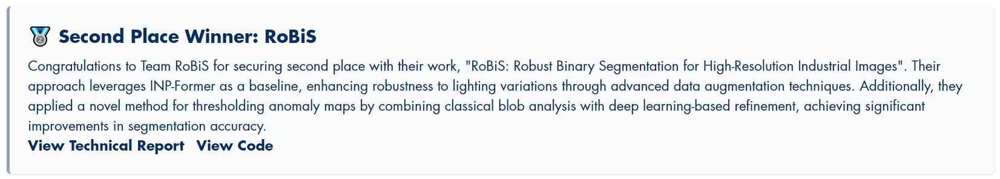

# ✨RoBiS: Robust Binary Segmentation for High-Resolution Industrial Images (*CVPR2025 VAND3.0 挑战赛赛道1的第二名方法*)

*---我们发布了可以在异常检测任务中广泛使用的代码，包括用于高分辨率图像的裁剪和合并的工具、连续异常图的自适应二值化工具，以及对二值掩码进行精修的SAM等*.

作者:
[李煦蕤](https://github.com/xrli-U)<sup>1</sup> | [蒋中盛](https://github.com/FoundWind7)<sup>1</sup> | [艾廷轩](https://aitingxuan.github.io/)<sup>1</sup> | [周瑜](https://github.com/zhouyu-hust)<sup>1,2</sup>

单位:
<sup>1</sup>华中科技大学 | <sup>2</sup>武汉精测电子集团股份有限公司

联系方式:
**xrli\_plus@hust.edu.cn** | zsjiang@hust.edu.cn | tingxuanai@hust.edu.cn | yuzhou@hust.edu.cn

赛道: 适应与检测——在现实世界的应用中实现鲁棒的异常检测

### 技术报告: [ResearchGate](https://www.researchgate.net/publication/392124350_RoBiS_Robust_Binary_Segmentation_for_High-Resolution_Industrial_Images) | [arXiv](https://arxiv.org/pdf/2505.21152) | [PDF](RoBiS.pdf)


## 🧐概述

这个项目是我们为CVPR 2025 VAND3.0挑战赛第一赛道所提出的**获奖解决方案RoBiS**的官方实现

我们的RoBiS结合了传统的*均值加上3倍标准差* 与发表在CVPR2025的MEBin模块[github link](https://github.com/HUST-SLOW/AnomalyNCD)来实现自适应二值化。这种策略使得我们的方法无需为每个类别产品人工确定不同的阈值。

MVTec基准测试服务器: [https://benchmark.mvtec.com/](https://benchmark.mvtec.com/).

挑战赛网址: [https://sites.google.com/view/vand30cvpr2025/challenge](https://sites.google.com/view/vand30cvpr2025/challenge)




## 🎯代码环境配置

### 环境:

- Python 3.8
- CUDA 11.7
- PyTorch 2.0.1

使用如下命令克隆该项目到本地:

```
git clone https://github.com/xrli-U/RoBiS.git
```

创建虚拟环境:

```
conda create --name RoBiS python=3.8
conda activate RoBiS
```

安装依赖库:

```
pip install torch==2.0.1 torchvision==0.15.2 torchaudio==2.0.2
pip install -r requirements.txt
```
## 👇数据集下载

通过官方链接([web](https://www.mvtec.com/company/research/datasets/mvtec-ad-2))下载[MVTec AD 2](https://arxiv.org/pdf/2503.21622)数据集 

把所有的数据集放在`./data`文件夹下。

```
data
|---mvtec_ad_2
|-----|-- can
|-----|-----|----- test_private
|-----|-----|----- test_private_mixed
|-----|-----|----- test_public
|-----|-----|----- train
|-----|-----|----- validation
|-----|-- fabric
|-----|--- ...
```

## 💎运行RoBiS
在运行我们的RoBiS之前，执行`download_weights.sh`脚本以下载预训练权重。
```
bash download_weights.sh
```
我们提供了两种方式运行我们的代码。

### 一个bash脚本完成所有步骤
```
bash VAND2025_track1_MAD2_reproduce_final_result.sh
```
你可以运行上述脚本以完成我们方法中的所有步骤。
连续异常图和经过阈值处理的二值化掩膜存储在`./submission_folder`用于评估。
最终的连续异常图可以在[google drive](https://drive.google.com/file/d/1OqejveTgEuYr9obEUV3h3Vzq2HTp29ua/view?usp=sharing)下载。
最终的二值化掩膜可以在[google drive](https://drive.google.com/file/d/1ilMnxisuQOYnvllu1kUHaibkzHiHN_R-/view?usp=sharing)下载。
有关该脚本更详细的参数，请参考下面的*逐步说明*.


### 逐步说明
**1.预处理**
```
python swin-cropping.py --data_path ./data/mvtec_ad_2 --save_path ./mvtec_ad_2_processed
```
请预留约50GB空间储存预处理数据。

关键参数如下:
- `--data_path`:原始数据集路径
- `--save_path`:保存预处理数据集的路径。该路径将自动创建。

**2.模型训练**
```
CUDA_VISIBLE_DEVICES=0 python INP_Former_Single_Class.py \
--data_path ./mvtec_ad_2_processed --save_dir ./saved_weights --phase train \
--mvtecad2_class_list sheet_metal vial wallplugs walnuts can fabric fruit_jelly rice
```
我们使用DINOv2-R初始化预训练权重的ViT-B-14作为编码器。
预训练权重会自动下载到`./backbones/weights/dinov2_vitb14_reg4_pretrain.pth`

如果要在默认设置下训练异常检测模型，请预留至少17GB的GPU内存。
你可以使用不同的GPU来训练不同的类别，以减少时间消耗。
你也可以通过这个链接下载训练好的权重[(google drive)](https://drive.google.com/drive/folders/1JvbEru6W1RxThjjiPJSONbO97j9_I6dN?usp=drive_link)。

关键参数如下:
- `--data_path`:预处理数据集路径。
- `--save_dir`:保存模型权重的路径。该路径将自动创建。
- `mvtecad2_class_list`:MVTec AD 2数据集的所有类别。由于我们的方法为每个类别训练一个模型，因此可以使用不同的GPU来训练不同的类别，以减少时间消耗。

**3.模型测试**
```
# 在test_private上测试
CUDA_VISIBLE_DEVICES=0 python INP_Former_Single_Class.py \
--data_path ./mvtec_ad_2_processed --save_dir ./saved_weights --amap_savedir ./anomaly_map_results --phase test --test_type test_private \
--mvtecad2_class_list sheet_metal vial wallplugs walnuts can fabric fruit_jelly rice

# 在test_private_mixed上测试
CUDA_VISIBLE_DEVICES=0 python INP_Former_Single_Class.py \
--data_path ./mvtec_ad_2_processed --save_dir ./saved_weights --amap_savedir ./anomaly_map_results --phase test --test_type test_private_mixed \
--mvtecad2_class_list sheet_metal vial wallplugs walnuts can fabric fruit_jelly rice
```
关键参数如下:
- `--data_path`:预处理数据集路径。
- `--save_dir`:保存模型权重的路径 
- `--amap_savedir`: 保存异常图*(.tiff)*的所有子图。该路径将自动创建。
- `--test_type`:选择MVTec AD 2数据集的测试集，设置为*test_private*或*test_private_mixed*。
- `mvtecad2_class_list`:MVTec AD 2数据集中的类别。

**4.后处理**
```
python merging.py --amap_savedir ./anomaly_map_results --test_type challenge
```
将子图像的异常图合并到对应的原始异常图中。

关键参数如下:
- `--amap_savedir`: 保存所有子图像异常图*(.tiff)*的路径。合并完成后，子图像的异常图将自动删除。

**5.二值化**
```
# 使用MEBin和均值加上3倍标准差生成初步二值化掩膜
python binarization.py --amap_savedir ./anomaly_map_results --bin_savedir ./binary_map_results --test_type challenge

# 使用SAM生成最终二值化掩膜
CUDA_VISIBLE_DEVICES=0 python SAM-Finer.py --data_path ./data/mvtec_ad_2 --bin_savedir ./binary_map_results --test_type challenge
```
在运行`SAM-Finer.py`之前，请确保预训练的SAM权重*(sam_b和sam_h)*已下载到当前的路径(`bash download_weights.sh`)。

关键参数如下:
- `--amap_savedir`:保存异常图的路径*(.tiff)*。
- `--bin_savedir`:保存经阈值处理的二值化掩膜的路径
- `--data_path`:原数据集路径

**6.压缩以用作评估**
我们将连续异常图和经过阈值处理的二值掩膜转移到`./submission_folder`以便于压缩和评估
```
mkdir -p ./submission_folder
cp -r ${amap_savedir}/anomaly_images ./submission_folder/
cp -r ${bin_savedir}/anomaly_images_thresholded ./submission_folder/
```
最终连续异常图可在此下载[google drive](https://drive.google.com/file/d/1OqejveTgEuYr9obEUV3h3Vzq2HTp29ua/view?usp=sharing)。

最终经阈值的二值化掩膜可在此下载[google drive](https://drive.google.com/file/d/1ilMnxisuQOYnvllu1kUHaibkzHiHN_R-/view?usp=sharing)。

## 🎖️结果

所有结果均由官方排行榜计算得出。

### MVTec AD 2

|   Object    | AucPro_0.05 |  ClassF1  |   SegF1   |   AucPro_0.05   |     ClassF1     |      SegF1      |
| :---------: | :---------: | :-------: | :-------: | :-------------: | :-------------: | :-------------: |
|             |  (private)  | (private) | (private) | (private_mixed) | (private_mixed) | (private_mixed) |
|     Can     |    30.28    |   60.93   |   1.86    |      20.03      |      65.04      |      0.84       |
|   Fabric    |    79.45    |   83.79   |   87.46   |      79.27      |      83.80      |      73.37      |
| Fruit Jelly |    74.46    |   87.35   |   53.63   |      74.11      |      87.55      |      52.62      |
|    Rice     |    62.27    |   72.00   |   63.86   |      63.89      |      73.45      |      63.23      |
| Sheet Metal |    75.51    |   87.68   |   70.98   |      73.54      |      86.69      |      70.92      |
|    Vial     |    76.81    |   84.61   |   48.73   |      69.59      |      85.77      |      48.83      |
| Wall Plugs  |    62.20    |   75.20   |   14.38   |      24.77      |      72.66      |      3.40       |
|   Walnuts   |    77.05    |   85.42   |   67.13   |      72.00      |      83.95      |      58.94      |
|    Mean     |    67.25    |   79.62   |   51.00   |      59.65      |      79.86      |      46.52      |


## 致谢

我们的工作基于[INP-Former](https://github.com/luow23/INP-Former)，感谢他们清晰且优雅的代码!

## License
RoBiS is released under the **MIT Licence**.

